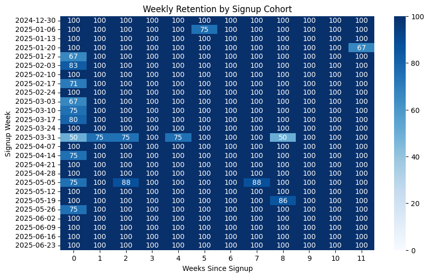

# LLM Product Analytics: Usage, Token Economics, and Retention

This project simulates analytics for a large-scale LLM API platform.

Many AI companies operate platforms where developers or companies
call language models through APIs. Understanding how users interact
with these models is critical for product growth, cost control,
and infrastructure planning.

In this project, I generate a synthetic dataset representing
LLM API usage across multiple users, models, and pricing tiers,
and perform product analytics similar to what a data analyst
might do at an AI platform company.

The analysis focuses on four key areas:

1. Usage patterns across models
2. Token economics and infrastructure cost
3. Power user behavior
4. Cohort retention after signup

---

# Dataset

Because real LLM usage data is not publicly available,
this project uses **synthetically generated data** that simulates
an AI API platform.

The dataset contains approximately:

- ~120 users
- ~30,000 API requests
- multiple LLM models
- token-based pricing and GPU cost estimates

Tables included:

### users

Represents companies or developers using the API.

| column | description |
|------|-------------|
| user_id | unique user |
| signup_date | signup time |
| industry | user industry |
| company_size | company scale |
| plan_type | free / pro / enterprise |

---

### api_requests

Each row represents one API request.

| column | description |
|------|-------------|
| request_id | request identifier |
| user_id | user making the request |
| timestamp | request time |
| model | LLM model used |
| prompt_tokens | input tokens |
| completion_tokens | output tokens |
| latency_ms | response latency |
| status | success / error |

---

### pricing

Simulated pricing and compute cost per model.

| column | description |
|------|-------------|
| model | model name |
| input_token_price | price per input token |
| output_token_price | price per output token |
| gpu_cost_per_1k_tokens | estimated inference cost |

---

### billing

Aggregated usage metrics per user.

| column | description |
|------|-------------|
| user_id | user |
| tokens_used | total tokens |
| requests | number of API calls |

---

# Analysis

## 1. Usage Analysis

First we analyze platform usage patterns across models.

Metrics examined:

- request volume
- total token usage
- average latency
- success rate

This helps identify which models drive the most demand
and which may require the most infrastructure capacity.

---

## 2. Token Economics

LLM platforms operate on a **token-based cost structure**.

For each request we estimate:

- revenue generated
- GPU inference cost
- gross profit
- margin

This analysis helps evaluate which models are profitable
and which may require pricing or infrastructure adjustments.

---

## 3. Power User Analysis

API platforms often exhibit a **skewed usage distribution**,
where a small number of users generate a large share of demand.

We analyze:

- token usage per user
- top user segments
- usage concentration

In this simulation:

- Top 10% of users generate ~18% of tokens
- Top 20% generate ~34%
- Top 30% generate ~48%

This reflects moderate usage concentration across users.

---

## 4. Cohort Retention

Retention analysis tracks whether users continue to use the
API after signup.

Users are grouped by signup week, and we track their activity
in subsequent weeks.

This helps measure:

- early product adoption
- long-term user engagement
- onboarding effectiveness

Retention is visualized using a **cohort heatmap**.

---

# Key Insights

From the simulated dataset we observe:

- Model usage is relatively balanced across the platform.
- Token consumption is the primary driver of both revenue
  and infrastructure cost.
- Usage distribution shows moderate concentration among
  high-activity users.
- Retention declines gradually over time, consistent with
  typical SaaS usage patterns.

---

# Example Visualization

Example cohort retention heatmap:



---

# Tech Stack

Python libraries used:

- pandas
- numpy
- matplotlib
- seaborn
- duckdb

---

# Repository Structure

```
llm-product-analytics
│
├── data
│ users.csv
│ api_requests.csv
│ pricing.csv
│ billing.csv
│
├── notebooks
│ llm_product_analytics.ipynb
│
├── figures
│   retention_heatmap.png
│
└── README.md
```

---

# Future Extensions

Possible extensions include:

- experiment analysis for model adoption
- pricing optimization
- user segmentation by industry
- infrastructure capacity forecasting

---

# Youqing Zhou

Personal portfolio project exploring analytics for AI platform products.
